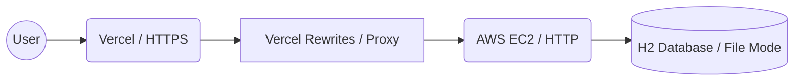

# 📔 MyEnglishVocab Project
> **사용자 맞춤형 예문 기반 영어 학습 플랫폼**

본 프로젝트는 단어와 뜻뿐만 아니라, 문맥(Context) 중심의 예문 학습을 선호하는 학습자를 위해 설계되었습니다. 프론트엔드와 백엔드를 독립적인 레포지토리로 분리하여 관리하며, 하이브리드 클라우드 환경에서 배포되었습니다.

---

## 🏗 System Architecture
본 서비스는 보안 정책(Mixed Content) 대응과 효율적인 CI/CD를 위해 다음과 같은 아키텍처를 가집니다.

---

## 🔗 Core Repositories
* **Frontend**: [GitHub Repository](https://github.com/MyEnglishVocab-Project/MyEnglishVocab)
  * React, TypeScript 기반의 SPA 및 모바일 최적화 UI

* **Backend**: [GitHub Repository](https://github.com/MyEnglishVocab-Project/MyEnglishVocab-Server)
  * Spring Boot 3.5.9, Java 21 기반의 RESTful API 서버
 
---

## 🚀 Key Technical Challenges
* **Hybrid Cloud Security**: Vercel(HTTPS)과 AWS EC2(HTTP) 간 통신 시 발생하는 보안 이슈를 SSL 인증서 발급 대신 Vercel Rewrites(Proxy) 설정을 통해 아키텍처적으로 해결했습니다.

* **Responsive Card UI**: 데스크탑의 테이블 구조를 모바일 환경에서 카드 형태의 뷰로 변환하는 반응형 디자인을 적용하여 사용자 경험을 최적화했습니다.

---

## 👤 Author
* **고현규 (Hyungyu)** - [GitHub Profile](https://github.com/hyungyu-02)
